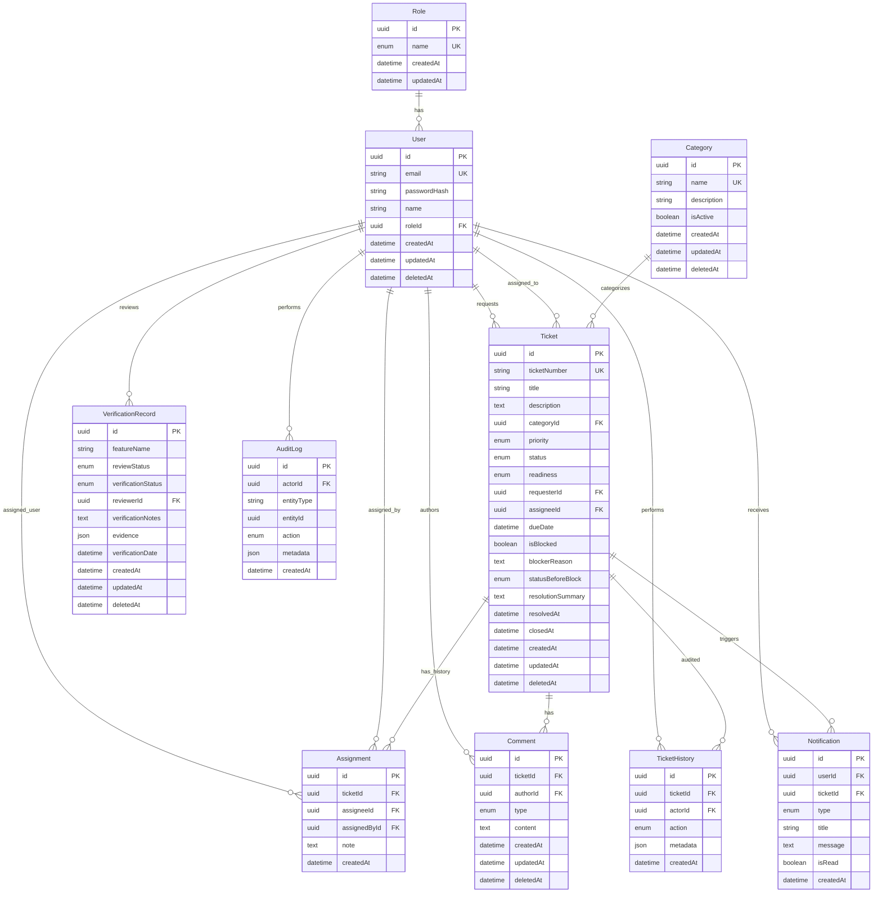

# HelpDesk Lite — Database ERD

> Entity-relationship design for PostgreSQL via Prisma

---

## 1. Entity Relationship Diagram



---

## 2. Entity Descriptions

### User
Internal staff account. Soft-deletable. Password stored as bcrypt hash.

### Role
Lookup table seeded with EMPLOYEE, AGENT, MANAGER, ADMIN.

### Category
Ticket classification. Admin-managed. Soft-deletable (inactive categories hidden from create form).

### Ticket
Core entity. `ticketNumber` is business key. `statusBeforeBlock` stores workflow state for unblock restoration. `isBlocked` mirrors `status === BLOCKED` for fast filtering.

### Assignment
Append-only assignment history. Each assign/reassign creates a row.

### Comment
`type`: PUBLIC | INTERNAL. Soft-deletable with audit trail preserved in TicketHistory.

### TicketHistory
Immutable audit log for ticket domain events. `metadata` JSON holds from/to values.

### Notification
In-app notification inbox per user. Optional link to ticket.

### VerificationRecord
AI governance module. `evidence` JSON array of structured evidence objects.

### AuditLog
Cross-entity audit (users, categories, verification records, admin actions).

---

## 3. Indexes

| Table | Index | Purpose |
|---|---|---|
| Ticket | ticketNumber | Unique lookup |
| Ticket | status | Filter + Kanban |
| Ticket | priority | Filter + sort |
| Ticket | requesterId | Employee dashboard |
| Ticket | assigneeId | Agent dashboard |
| Ticket | categoryId | Filter |
| Ticket | isBlocked | Blocked filter |
| Ticket | createdAt | Date range filter |
| Ticket | deletedAt | Soft delete scope |
| Ticket | (status, assigneeId) | Agent board composite |
| Comment | ticketId | Detail page load |
| TicketHistory | ticketId, createdAt | Timeline |
| Notification | userId, isRead | Inbox |
| Assignment | ticketId, createdAt | History |
| VerificationRecord | reviewStatus | Governance filters |
| AuditLog | entityType, entityId | Audit view |

---

## 4. Enumerations

### TicketStatus
`NEW`, `ASSIGNED`, `IN_PROGRESS`, `BLOCKED`, `WAITING_FOR_REQUESTER`, `RESOLVED`, `CLOSED`

### TicketPriority
`LOW`, `MEDIUM`, `HIGH`, `CRITICAL`

### ReadinessState
`READY`, `PARTIAL`, `BLOCKED`, `NOT_READY`

### CommentType
`PUBLIC`, `INTERNAL`

### TicketHistoryAction
`CREATED`, `ASSIGNED`, `REASSIGNED`, `STATUS_CHANGED`, `PRIORITY_CHANGED`, `BLOCKED`, `UNBLOCKED`, `COMMENT_ADDED`, `RESOLUTION_ADDED`, `CLOSED`, `READINESS_CHANGED`, `UPDATED`

### NotificationType
`ASSIGNED`, `REASSIGNED`, `BLOCKED`, `COMMENT`, `STATUS_CHANGED`

### ReviewStatus
`ACCEPTED`, `NEEDS_REVISION`, `REJECTED`, `ROLLED_BACK`

### VerificationStatus
`PENDING`, `VERIFIED`, `FAILED`

### RoleName
`EMPLOYEE`, `AGENT`, `MANAGER`, `ADMIN`

---

## 5. Referential Integrity

- All FKs use `ON DELETE RESTRICT` except Notification (CASCADE on user delete blocked by soft delete pattern)
- Soft delete: queries default to `WHERE deletedAt IS NULL`
- Ticket assignee/requester FK to User with RESTRICT

---

## 6. Sample Queries

### Agent workload (Manager dashboard)
```sql
SELECT u.name, COUNT(t.id) AS open_count
FROM users u
LEFT JOIN tickets t ON t.assignee_id = u.id
  AND t.status NOT IN ('RESOLVED', 'CLOSED')
  AND t.deleted_at IS NULL
WHERE u.role_id = (SELECT id FROM roles WHERE name = 'AGENT')
GROUP BY u.id, u.name;
```

### Average resolution time
```sql
SELECT AVG(EXTRACT(EPOCH FROM (resolved_at - created_at))) AS avg_seconds
FROM tickets
WHERE resolved_at IS NOT NULL AND deleted_at IS NULL;
```

---

## 7. Migration Strategy

1. Initial migration: all tables + enums + indexes
2. Seed migration: roles, categories, demo users, sample tickets
3. Production: `prisma migrate deploy` only—no db push
